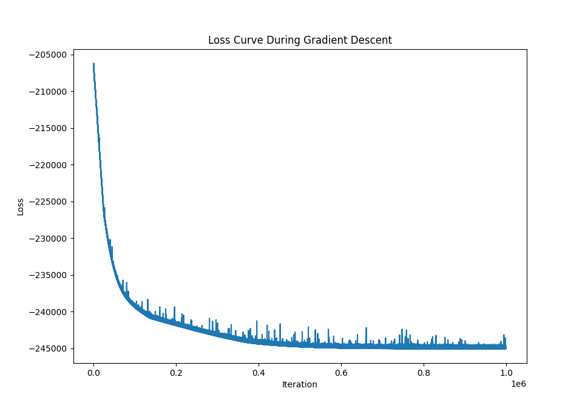

# Life Insurance Optimization
Using gradient descent to optimize premiums schedules for universal life insurance policies. 

## The Problem

Given a universal life-insurance policy with flexible premiums schedule, what is the premiums schedule that maximizes expected present value?

Three previous plans exist: a constant premiums schedule, maximizing premiums upfront, and delaying premiums until they are due. Of these, the upfront premiums schedule has the greatest expected present value. 

Our model uses gradient descent to find that a combination of upfront and delayed premiums results in the highest expected present value (EPV). **Our model gives 2.79% higher EPV (a $6,655.70 gain) than the previous best schedule: the upfront premiums schedule.**

## Training

- Model run with Adaptive Moment Estimation gradient descent, 1,000,000 iterations, and a learning rate of 0.001.
- Exponential preprocessing was applied to premiums input to reduce the input space to positive values and increase training speed.
- Loss function applies a combination of expected present value with an ELU function applied to the remaining negative balance, as inputted premiums schedule must end with a positive remaining balance.

## Results

### Expected Present Values of Different Schedules

| Strategy                              | Expected Present Value (EPV) |
|----------------------------------------|-----------------------|
| **Previous Model: Constant Premiums**             | $211,010.95           |
| **Previous Model: Upfront Premiums**                | $238,397.97           |
| **Our Model: Linear Preprocessing**   | $240,270.94           |
| **Our Model: Exponential Preprocessing** | $245,053.67           |

Our exponential model results in 2.79% higher EPV than the Upfront Premiums Model, and 16.13% higher EPV than the Constant Premiums Model.

---

### Premium Schedules by Year, in Dollars

| Year | Previous Model: Constant Premiums | Previous Model: Upfront Premiums | Our Model: Linear Preprocessing | Our Model: Exponential Preprocessing |
|------|---------------------------|---------------------------|-----------------------------------|---------------------------------------|
| 1    | 33,631.48                 | 299,194.03                | 93,725.19                         | 206,970.72                            |
| 2    | 33,631.48                 | 0.00                      | 84,857.21                         | 99.69                                 |
| 3    | 33,631.48                 | 0.00                      | 27,488.98                         | 0.00                                  |
| 4    | 33,631.48                 | 0.00                      | 7,035.36                          | 0.00                                  |
| 5    | 33,631.48                 | 0.00                      | 0.00                              | 0.00                                  |
| 6    | 33,631.48                 | 0.00                      | 0.00                              | 0.00                                  |
| 7    | 33,631.48                 | 0.00                      | 0.00                              | 0.00                                  |
| 8    | 33,631.48                 | 0.00                      | 0.00                              | 0.00                                  |
| 9    | 33,631.48                 | 0.00                      | 0.00                              | 0.00                                  |
| 10   | 33,631.48                 | 0.00                      | 0.00                              | 0.00                                  |
| 11   | 33,631.48                 | 0.00                      | 0.00                              | 0.00                                  |
| 12   | 33,631.48                 | 0.00                      | 0.00                              | 0.00                                  |
| 13   | 33,631.48                 | 0.00                      | 0.00                              | 0.00                                  |
| 14   | 33,631.48                 | 0.00                      | 13,313.55                         | 0.00                                  |
| 15   | 33,631.48                 | 0.00                      | 54,829.45                         | 0.24                                  |
| 16   | 33,631.48                 | 0.00                      | 101,742.62                        | 137,528.30                            |
| 17   | 33,631.48                 | 0.00                      | 141,815.95                        | 152,636.11                            |
| 18   | 33,631.48                 | 0.00                      | 176,011.53                        | 168,792.05                            |
| 19   | 33,631.48                 | 0.00                      | 171,574.17                        | 185,921.27                            |
| 20   | 33,631.48                 | 0.00                      | 203,483.45                        | 204,047.02                            |

---