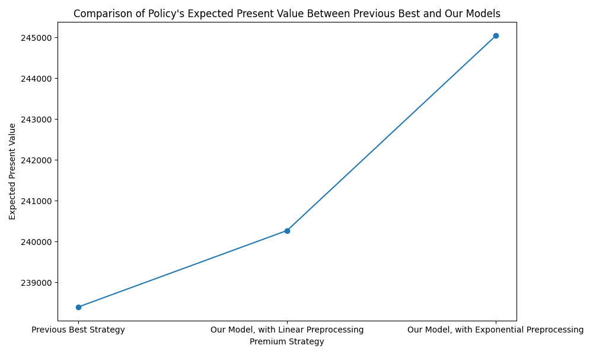

# Life Insurance Optimization
Using Gradient Descent to Optimize Premiums Schedule for Universal Life Insurance Policy

## The Problem

Given a universal life-insurance policy with flexible premiums schedule, what is the premiums schedule that maximizes expected present value?

Three previous plans exist: a constant premiums schedule, maximizing premiums upfront, and delaying premiums until they are due.

Our model uses gradient descent to find that a combination of upfront and delayed premiums results in the highest expected present value. 

## Training

- Model run with Adaptive Moment Estimation gradient descent, 1,000,000 iterations, and a learning rate of 0.001.
- Exponential preprocessing was applied to premiums input to reduce the input space to positive values and increase training speed.
- Loss function applies a combination of expected present value with an ELU function applied to the remaining negative balance, as inputted premiums schedule must end with a positive remaining balance.

